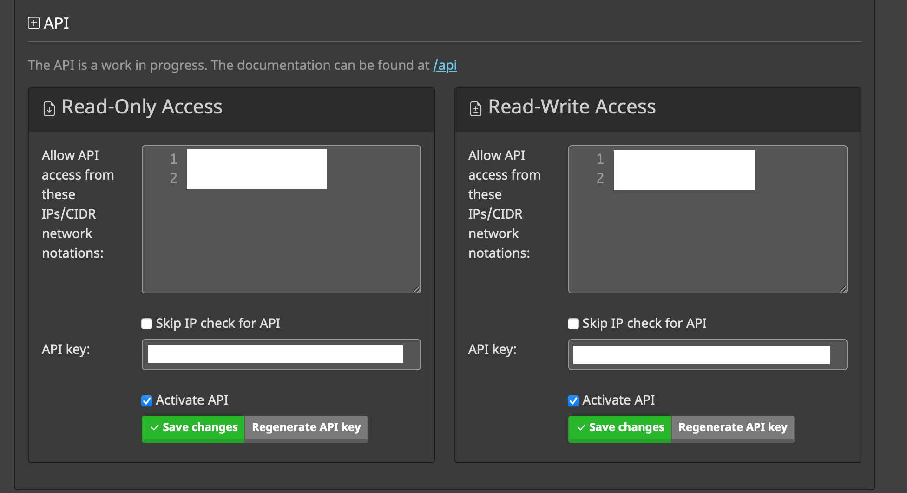

# Mailcow ruby scripts

I migrated my mailserver from a standalone postfix+dovecot to a [mailcow](https://mailcow.email) installation in several Docker containers. The problem I had was that I had 422 aliases, spread over several domains, and entering them all by hand on the website seemed…tedious. Luckily, mailcow has a good API and while I am not a web developer, I tried to hack a script together to automate this process.
As this script only needs to be run several times, I chose to munge aliases data from postfix by hand. you basically have to change the format. I'll explain this [here](#data-munging)

The list of available [Functions](Functions.md):

* [getMailboxes(domain)](Functions.md/#getmailboxes)
* [getAliases(id)
* [getDomainAliases(mailbox)
* [addAlias(aliasEmail, mailbox)
* [getBlacklist(domain)
* [addBlacklist(domain, email)
* [addBlacklistList(domain, emails)
* [addAliasesFromHash(aliasHash)](Functions.md/#addAliasesFromHash)
* [getDKIM(domain)


# Install
python is not my forte, and ruby was an old love of mine, so this script is written in ruby. It requires the following libraries:

* 'json'
* 'net/http'

I installed these libraries using 

```
gem install json
gem install net-http
```

# Usage
All the code is contained in the `addalias.rb` file. Place server specific sensitive data, like hostname and api keys in a `secrets.rb` file, which is included in the main script, but excluded from git commits.


# Preparation

## secrets.rb

Because you don't want any credentials or tokens on public repositories, I placed these in a `secrets.rb` file, which is included in the .gitignore, so it is never uploaded to the github repository.
I have created a `secrets-sample.rb` with an example of the contents.


### Host
`$BaseURL` contains the hostname where the mailcow api is hosted. 

### API Keys
You need to create one or two API keys, on the `admin` page of your mailcow installation.


If you only want to experiment first with the scripts without making irreversible changes to you mailcow installation, create and use the `Read-Only Access` API. Then, when you're ready to add aliases and domains, create and switch to the `Read-Write Access` API key.

## Data munging
megamac.nl      de oude winkelnaam
axel@megamac.nl         axel     
axellist@megamac.nl     axellist 
